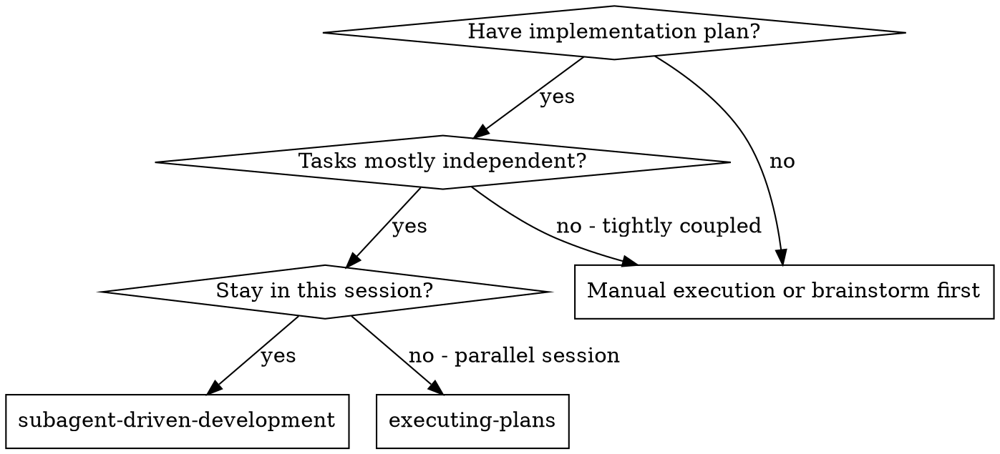
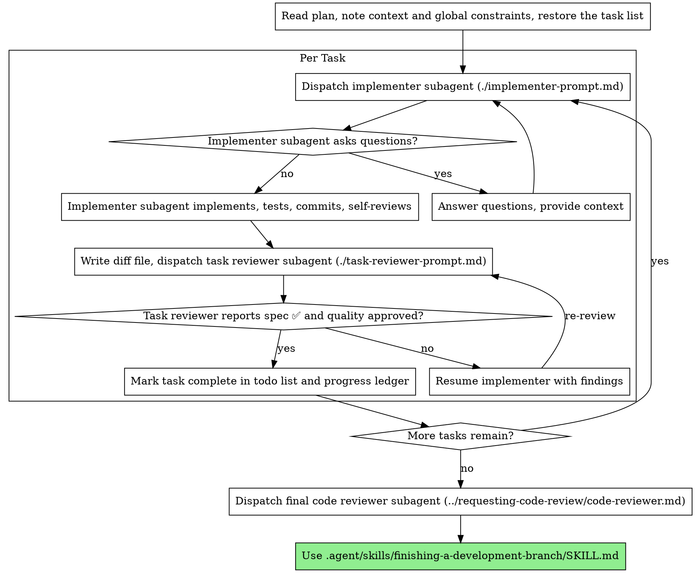

# Subagent-Driven Development

Execute plan by dispatching a fresh implementer subagent per task, a task review (spec compliance + code quality) after each, and a broad whole-branch review at the end.

**Why subagents:** You delegate tasks to specialized agents with isolated context. By precisely crafting their instructions and context, you ensure they stay focused and succeed at their task. They should never inherit your session's context or history — you construct exactly what they need. This also preserves your own context for coordination work.

**Core principle:** Fresh subagent per task + task review (spec + quality) + broad final review = high quality, fast iteration

**Narration:** between tool calls, narrate at most one short line — the
ledger and the tool results carry the record.

**Continuous execution:** Do not pause to check in between tasks; execute all tasks from the plan without stopping. Stop only for an unresolved BLOCKED status, ambiguity that genuinely prevents progress, or completion. "Should I continue?" prompts and progress summaries waste their time — they asked you to execute the plan, so execute it.

## Adapter Link

Tool selection is governed by `${CLAUDE_PLUGIN_ROOT}/skills/shared/conductor/routing.md` — declare the job (discovery / symbol-edit / docs / output / dispatch / memory) and follow its chain. `review-package` and `task-brief` analysis go through `ctx_execute_file`.

## When to Use

**vs. Executing Plans (parallel session):**
- Same session (no context switch)
- Fresh subagent per task (no context pollution)
- Review after each task (spec compliance + code quality), broad review at the end
- Faster iteration (no human-in-loop between tasks)

## The Process

## Pre-Flight Plan Review

See [references/controller-operations.md](references/controller-operations.md#pre-flight-plan-review) — Scanning the plan for internal conflicts and batching them as one question before Task 1.

## Model Selection

See [references/controller-operations.md](references/controller-operations.md#model-selection) — Model-tier selection by role, turn-count economics, task-complexity. Mechanical/symbol-refactor/review dispatch: `${CLAUDE_PLUGIN_ROOT}/skills/shared/conductor/middleware.md`'s Dispatch matrix.

## Handling Implementer Status

See [references/controller-operations.md](references/controller-operations.md#handling-implementer-status) — Handling DONE / DONE_WITH_CONCERNS / NEEDS_CONTEXT / BLOCKED implementer statuses.

## Response Shape in Dispatches

A subagent's system prompt is its agent definition, not this session's output style — across
49,895 subagent turns, "Output Style" appears 0 times. Every prompt this skill constructs
inlines the shape rules directly. Report structure, status line, evidence, return format:
[references/dispatch-and-handoffs.md](references/dispatch-and-handoffs.md#response-shape-in-dispatches).

## Handling Reviewer ⚠️ Items

The task reviewer may report "⚠️ Cannot verify from diff" items — requirements in unchanged
code or spanning tasks. These don't block the rest of the review, but you must resolve each
yourself before marking the task complete — you hold plan and cross-task context the reviewer
lacks. A confirmed gap is a failed spec review: send it back to the implementer and re-review.

## Constructing Reviewer Prompts

See [references/dispatch-and-handoffs.md](references/dispatch-and-handoffs.md#constructing-reviewer-prompts) — Rules for constructing per-task and final reviewer prompts and fix dispatches.

## File Handoffs

**The implementer writes its full report to a file as its final action and returns only a
short status; the orchestrator reads that file, never re-prompts the agent for it** — an idle
implementer costs a round trip to reconstruct, and a returned message is compressed where a
file is not. Full contract: [references/dispatch-and-handoffs.md](references/dispatch-and-handoffs.md#file-handoffs).

## Dispatching with Metadata

See [references/dispatch-and-handoffs.md](references/dispatch-and-handoffs.md#dispatching-with-metadata) — Filling the implementer template from the plan's json:metadata fence.

## Parallel Waves (guarded)

Dispatch multiple implementers in one message ONLY when every pair of tasks has provably disjoint
`files` sets in metadata AND verify commands are side-effect independent. Anything riskier: worktree
isolation per implementer, or sequential dispatch — these guardrails answer the workspace-conflict
objection to parallel implementers, not an exemption from it.

## E2E Process Hygiene

See [references/controller-operations.md](references/controller-operations.md#e2e-process-hygiene) — Background-service cleanup snippets for E2E/service tasks.

## Durable Progress

**The orchestrator maintains a running carried-constraints list in the ledger and re-emits it
into every dispatched brief** — a later task silently violating an earlier task's constraint
is a task-ordering defect. Progress-ledger file, resume-after-compaction, recovery, and the
carried-constraints list: [references/controller-operations.md](references/controller-operations.md#durable-progress).

## Task Persistence Sync

See [references/controller-operations.md](references/controller-operations.md#task-persistence-sync) — Restoring the native task list from .tasks.json at entry; syncing it back after each the task.md task list.

## Prompt Templates

- [implementer-prompt.md](implementer-prompt.md) - Dispatch implementer subagent
- [task-reviewer-prompt.md](task-reviewer-prompt.md) - Dispatch task reviewer subagent (spec compliance + code quality)
- Final whole-branch review: use .agent/skills/requesting-code-review/SKILL.md's [code-reviewer.md](../requesting-code-review/code-reviewer.md)

## Example Workflow

See [references/example-and-advantages.md](references/example-and-advantages.md#example-workflow) — Worked end-to-end example of the per-task loop.

## Advantages

See [references/example-and-advantages.md](references/example-and-advantages.md#advantages) — Advantages vs. manual execution and executing-plans; efficiency, quality, cost.

## Red Flags

**Never:**
- Start implementation on main/master branch without explicit user consent
- Skip task review, or accept a report missing either verdict (spec compliance AND task quality are both required)
- Proceed with unfixed issues
- Dispatch multiple implementation subagents in parallel outside the
  guardrails of [Parallel Waves (guarded)](#parallel-waves-guarded)
  (workspace conflicts)
- Make a subagent read the whole plan file (hand it its task brief —
  `scripts/task-brief` — instead)
- Skip scene-setting context (subagent needs to understand where task fits)
- Ignore subagent questions (answer before letting them proceed)
- Accept "close enough" on spec compliance (reviewer found spec issues = not done)
- Skip review loops (reviewer found issues = implementer fixes = review again)
- Let implementer self-review replace actual review (both are needed)
- Tell a reviewer what not to flag, or pre-rate a finding's severity in the
  dispatch prompt ("treat it as Minor at most") — the plan's example code is
  a starting point, not evidence that its weaknesses were chosen
- Dispatch a task reviewer without a diff file — generate it first
  (`scripts/review-package PLAN_FILE BASE HEAD`) and name the printed path in the
  prompt
- Move to next task while the review has open Critical/Important issues
- Re-dispatch a task the progress ledger already marks complete — check
  the ledger (and `git log`) after any compaction or resume

**If subagent asks questions:**
- Answer clearly and completely
- Provide additional context if needed
- Don't rush them into implementation

**If reviewer finds issues:**
- Implementer (same subagent) fixes them
- Reviewer reviews again
- Repeat until approved
- Don't skip the re-review

**If subagent fails task:**
- Dispatch fix subagent with specific instructions
- Don't try to fix manually (context pollution)

## Integration

See [references/example-and-advantages.md](references/example-and-advantages.md#integration) — Required, subagent, and alternative workflow skills this skill integrates with.
