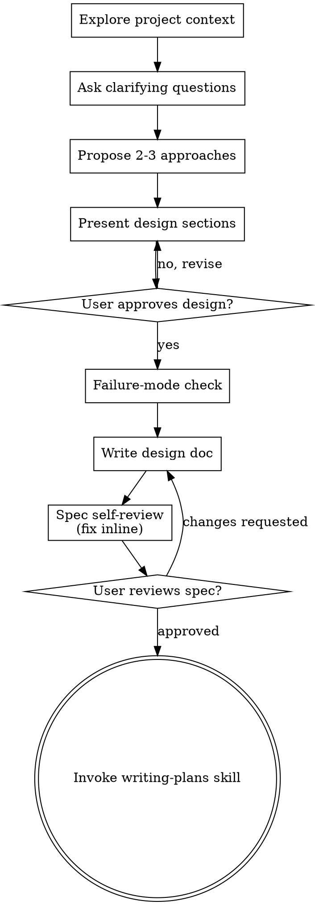

# Brainstorming Ideas Into Designs

Help turn ideas into fully formed designs and specs through natural collaborative dialogue.

Start by understanding the current project context, then ask questions one at a time to refine the idea. Once you understand what you're building, present the design and get user approval.

<HARD-GATE>
Do NOT invoke any implementation skill, write any code, scaffold any project, or take any implementation action until you have presented a design and the user has approved it. This applies to EVERY project regardless of perceived simplicity.
</HARD-GATE>

## Tool Selection

Tool selection is governed by `skills/shared/conductor/routing.md` — declare the job (discovery / symbol-edit / docs / output / dispatch / memory) and follow its chain (macro discovery → `codegraph.md`; external docs → `context7.md`). Evidence handling per `skills/shared/evidence.md`.

## Anti-Pattern: "This Is Too Simple To Need A Design"

Every project goes through this process. A todo list, a single-function utility, a config change — all of them. "Simple" projects are where unexamined assumptions cause the most wasted work. The design can be short (a few sentences for truly simple projects), but you MUST present it and get approval.

## Checklist

You MUST create a task for each of these items and complete them in order:

1. **Explore project context** — check files, docs, recent commits, and `docs/adr/` if present
2. **Offer the visual companion just-in-time** — NOT upfront. The first time a question would genuinely be clearer shown than described, offer it then (its own message); on approval its browser tab opens for you. If no visual question ever arises, never offer it. See the Visual Companion section below.
3. **Ask clarifying questions** — one at a time, understand purpose/constraints/success criteria
4. **Propose 2-3 approaches** — with trade-offs and your recommendation
5. **Present design** — in sections scaled to their complexity, get user approval after each section
6. **Failure-mode check** — before writing the doc, actively try to break the approved design; revise for Critical failure modes, document Minor ones as non-goals (see below)
7. **Write design doc** — save to `.superpowers/specs/YYYY-MM-DD-<topic>-design.md` (gitignored, local by default — do NOT commit it unless your human partner explicitly asks)
8. **Spec self-review** — quick inline check for placeholders, contradictions, ambiguity, scope (see below)
9. **User reviews written spec** — ask user to review the spec file before proceeding
10. **Transition to implementation** — invoke writing-plans skill to create implementation plan

## Process Flow



**The terminal state is invoking writing-plans.** Do NOT invoke frontend-design, mcp-builder, or any other implementation skill. The ONLY skill you invoke after brainstorming is writing-plans.

## The Process

**Understanding the idea:**

- Check out the current project state first (files, docs, recent commits)
- Before asking detailed questions, assess scope: if the request describes multiple independent subsystems (e.g., "build a platform with chat, file storage, billing, and analytics"), flag this immediately. Don't spend questions refining details of a project that needs to be decomposed first.
- If the project is too large for a single spec, help the user decompose into sub-projects: what are the independent pieces, how do they relate, what order should they be built? Then brainstorm the first sub-project through the normal design flow. Each sub-project gets its own spec → plan → implementation cycle.
- For appropriately-scoped projects, ask questions one at a time to refine the idea
- Prefer multiple choice questions when possible, but open-ended is fine too
- Only one question per message - if a topic needs more exploration, break it into multiple questions
- Focus on understanding: purpose, constraints, success criteria

**Exploring approaches:**

- Propose 2-3 different approaches with trade-offs
- Present options conversationally with your recommendation and reasoning
- Lead with your recommended option and explain why
- YAGNI ruthlessly - remove unnecessary features from every approach and design

**Presenting the design:**

- Once you understand what you're building, present the design
- Scale each section to complexity: a few sentences if simple, up to 200-300 words if nuanced
- Send each section as its own standalone message ending the turn; ask if it's right only next turn — same-turn coupling hides the design
- Cover: architecture, components, data flow, errors, testing

**Design quality:** guidance on designing for isolation and clarity, engineering rigor, and working in existing codebases is in `skills/brainstorming/references/design-details.md`.

## After the Design

**Failure-mode check:**
Before writing the doc, state the top 2-3 ways the chosen approach could fail or not cover all cases. This is adversarial reasoning, not a list of known assumptions — actively try to break the design. For each failure mode found, assess severity:

- **Critical** (design fails for a significant user scenario): revise the design before proceeding.
- **Minor** (edge case, acceptable limitation): document as a non-goal in the design.

Do not skip this step. An approach that survives adversarial questioning is an approach worth approving.

**Documentation:**

- Write the validated design (spec) to `.superpowers/specs/YYYY-MM-DD-<topic>-design.md`
  - (User preferences for spec location override this default)
- Use elements-of-style:writing-clearly-and-concisely skill if available
- Commit the design document to git
- Distill the approved design into an ADR in `docs/adr/` (committable), per `skills/shared/conductor/doc-format.md` conventions, in addition to the local spec — skip silently if the project has no `docs/` convention or the user declines

**Spec Self-Review:**
After writing the spec document, look at it with fresh eyes:

1. **Placeholder scan:** Any "TBD", "TODO", incomplete sections, or vague requirements? Fix them.
2. **Internal consistency:** Do any sections contradict each other? Does the architecture match the feature descriptions?
3. **Scope check:** Is this focused enough for a single implementation plan, or does it need decomposition?
4. **Ambiguity check:** Could any requirement be interpreted two different ways? If so, pick one and make it explicit.

Fix any issues inline. No need to re-review — just fix and move on.

**User Review Gate:**
After the spec review loop passes, send the notice below as its own standalone message ending the turn; ask for approval only next turn — same-turn coupling hides the spec:

> "Spec written and committed to `<path>`. Please review and flag changes before the plan is written."

Wait for the response next turn. If changes are requested, re-run the review loop. Proceed only once approved.

**Implementation:**

- Invoke the writing-plans skill to create a detailed implementation plan
- Do NOT invoke any other skill. writing-plans is the next step.

## Visual Companion

A browser-based companion for showing mockups, diagrams, and visual options during brainstorming. Available as a tool — not a mode. Accepting the companion means it's available for questions that benefit from visual treatment; it does NOT mean every question goes through the browser.

**Offering the companion (just-in-time):** Do NOT offer it upfront. Wait until a question would genuinely be clearer shown than told — a real mockup / layout / diagram question, not merely a UI *topic*. The first time that happens, offer it then, as its own message:
> "This next part might be easier if I show you — I can put together mockups, diagrams, and comparisons in a browser tab as we go. It's still new and can be token-intensive. Want me to? I'll open it for you."

**This offer MUST be its own message.** Only the offer — no clarifying question, summary, or other content. Wait for the user's response. If they accept, start the server with `--open` so their browser opens to the first screen automatically. If they decline, continue text-only and don't offer again unless they raise it.

**Per-question decision:** Even after the user accepts, decide FOR EACH QUESTION whether to use the browser or the terminal. The test: **would the user understand this better by seeing it than reading it?**

- **Use the browser** for content that IS visual — mockups, wireframes, layout comparisons, architecture diagrams, side-by-side visual designs
- **Use the terminal** for content that is text — requirements questions, conceptual choices, tradeoff lists, A/B/C/D text options, scope decisions

A question about a UI topic is not automatically a visual question. "What does personality mean in this context?" is a conceptual question — use the terminal. "Which wizard layout works better?" is a visual question — use the browser.

If they agree to the companion, read the detailed guide before proceeding:
`skills/brainstorming/visual-companion.md`

## Exit Criteria

- User approved the design.
- Failure-mode check completed — critical failure modes resolved, minor ones documented as non-goals.
- Design document exists at the required path (`.superpowers/specs/`).
- Spec self-review completed — placeholders, contradictions, ambiguity, and scope issues resolved.
- User reviewed the written spec and approved.
- `superpowers:writing-plans` is invoked as the next skill.

## Native Task Integration

**REQUIRED:** Use native task tools to create structured tasks during design.

### During Design Validation

After each design section is validated, create a task with a structured description:

```yaml
TaskCreate:
  subject: "Implement [Component Name]"
  description: |
    **Goal:** [What this component produces]

    **Files:**
    - Create/Modify: [paths identified during design]

    **Acceptance Criteria:**
    - [ ] [Criterion from design validation]
    - [ ] [Criterion from design validation]

    **Verify:** [How to test this component works]

    ```json:metadata
    {"files": ["path/from/design"], "acceptanceCriteria": ["criterion 1", "criterion 2"]}
    ```
  activeForm: "Implementing [Component Name]"
```

These tasks are refined with steps and verify commands during plan writing. See `skills/shared/task-format-reference.md` for the full format. Track all task IDs for dependency setup.

### After All Components Validated

Set up dependency relationships with `TaskUpdate(taskId, addBlockedBy:[prerequisite-ids])`.

### Before Handoff

Run `TaskList` to display the complete task structure with dependencies.
